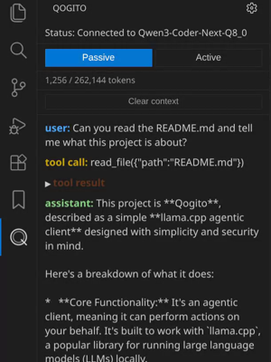

# Qogito README

This is a simple llama.cpp agentic client aiming for simplicity and security.

## Features

* 2 agentic modes:
    * Passive: allow search and reads
    * Active: allow file/directory creation, file removal and file editing
* Separate completion endpoint
* One shot transformation of selected text in editor in pop up menu
* Auto compacting of conversations when reaching 95% of context
* Validates all paths to current workspace

## Requirements

This will not setup llama.cpp for you. You are expected to have it running with the appropriate parameters for your model.

## Release Notes

### 1.1.0

Add an option to allow self signed certificates
Fix repository url in the package.json

### 1.0.0

Initial release of Qogito

## Bugs/Contributions

The source code is available on [Github](https://github.com/RipleyTom/qogito).
Contributions are welcome, keeping in mind the principle of simplicity this extension aims for.
